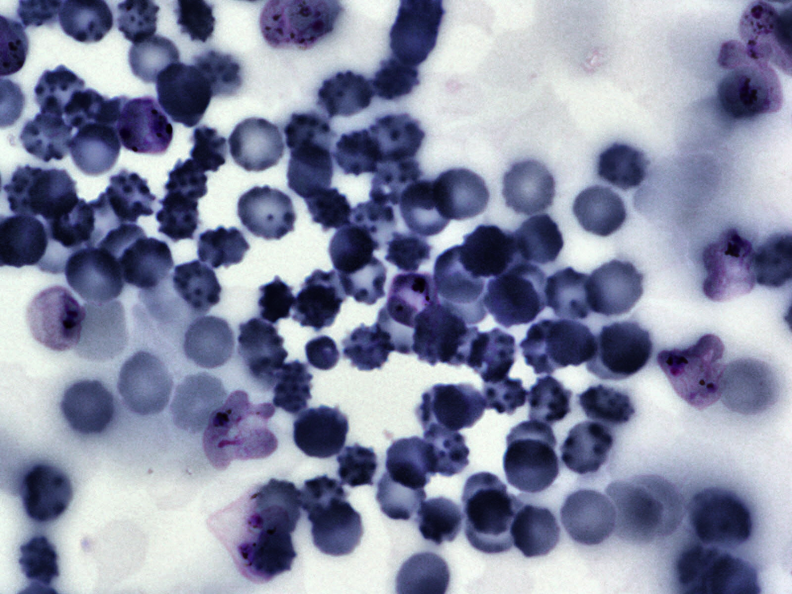

# ML-MBIA

## *ML-Malaria-Blood-Images-Analysis*

Machine learning - object detection and classification project

---

## **Contents:**

### 1. [Context](#context)

### 2. [Dataset](#dataset)

### 3. [Problem Statement](#problem-statement)

---

## **Context**

Malaria is a disease caused by Plasmodium parasites that remains a major threat in global health, affecting 200 million people and causing 400,000 deaths a year. The main species of malaria that affect humans are Plasmodium falciparum and Plasmodium vivax.

For malaria as well as other microbial infections, manual inspection of thick and thin blood smears by trained microscopists remains the gold standard for parasite detection and stage determination because of its low reagent and instrument cost and high flexibility. Despite manual inspection being extremely low throughput and susceptible to human bias, automatic counting software remains largely unused because of the wide range of variations in brightfield microscopy images. However, a robust automatic counting and cell classification solution would provide enormous benefits due to faster and more accurate quantitative results without human variability; researchers and medical professionals could better characterize stage-specific drug targets and better quantify patient reactions to drugs.

Previous attempts to automate the process of identifying and quantifying malaria have not gained major traction partly due to difficulty of replication, comparison, and extension. Authors also rarely make their image sets available, which precludes replication of results and assessment of potential improvements. The lack of a standard set of images nor standard set of metrics used to report results has impeded the field.

Context source

---

## **Dataset**

### **Source**

Dateset was published on [**Kaggle**](https://www.kaggle.com/datasets/kmader/malaria-bounding-boxes) platform by [*K Scott Mader*](https://www.kaggle.com/kmader) in 2019 with [Attribution-NonCommercial-ShareAlike 3.0 IGO (CC BY-NC-SA 3.0 IGO)](https://creativecommons.org/licenses/by-nc-sa/3.0/igo/) license and is available for download [**here**](https://www.kaggle.com/datasets/kmader/malaria-bounding-boxes/download?datasetVersionNumber=1).

### **Content**

Images are in `.png` or `.jpg` format. There are **3 sets** of images consisting of **1364 images** (*~80,000 cells*) with different researchers having prepared each one: from Brazil (Stefanie Lopes), from Southeast Asia (Benoit Malleret), and time course (Gabriel Rangel). Blood smears were stained with Giemsa reagent.

> *Dataset's sample image*

### **Labels**

The data consists of **two classes of uninfected cells** (*RBCs and leukocytes*) and **four classes of infected cells** (*gametocytes, rings, trophozoites, and schizonts*).

|   **Label**   |  **Category**  |
|---------------|----------------|
|`Uninfected`   | red blood cell |
|`Uninfected`   | leukocyte      |
|`Infected`     | gametocyte     |
|`Infected`     | ring           |
|`Infected`     | trophozoite    |
|`Infected`     | schizont       |

Annotators were permitted to mark some cells as difficult if not clearly in one of the cell classes. The data had a heavy imbalance towards uninfected RBCs versus uninfected leukocytes and infected cells, making up over 95% of all cells.

A class label and set of bounding box coordinates were given for each cell. For all data sets, infected cells were given a class label by Stefanie Lopes, malaria researcher at the Dr. Heitor Vieira Dourado Tropical Medicine Foundation hospital, indicating stage of development or marked as difficult.

---

## **Problem Statement**

Given the image data which contains cells of 6 different classes of which 2 classes are of uninfected cells and 4 classes of infected cells. We have to build a model which can localize each object cells in an image with bounding box and detect the class of cells with high confidence score and with high mean average precision.
